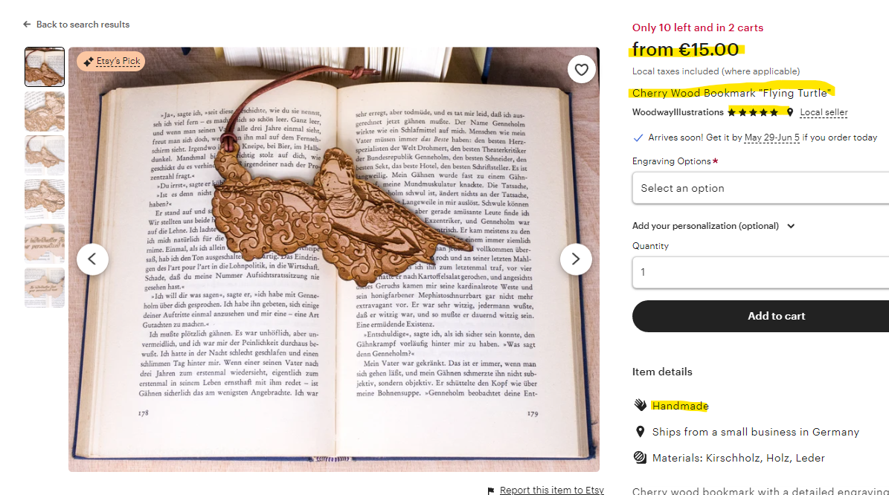

# Scraper for etsy.com
[![python][python-badge]][python-link][![jupyter][jupyter-badge]][jupyter-link][![vsc][vsc-badge]][vsc-link]
### The scraper reads front-end html information, prase it using lxml, cleans date and store it in a dictionary until it is completed and pass it to txt file. From there via a Jupyter Notebook, Frames the output and run a brief analysis. 

1. Opens the browser with the given url
2. generates a search
3. the scraper scrapes the first listing
4. navigate to its detail page view
5. Scrapes detail page values
6. Append values in a lsit
7. Creates a blank python dictionary
8. Fills up the dictionary by accessing values in the list
9. Pass the dictionary as a string to a txt. file
10. Repeats the same steps for the next listing in the search results


## Usage example
Using the following url with a interation on the page count for a search on bookmarks: "https://www.etsy.com/de/search?q=bookmarks&ref=pagination&page="+str(page). Below the detail page view of the items:


### Scraped results in json

```ruby
{
    "date": "2023-07-16", 
    "order": 1,
    "item_id": "1108461163",
    "page_num": "1", 
    "iteration": 1, 
    "position_num": "1", 
    "shop_id": "32322470", 
    "item_link": "https://www.etsy.com/de-en/listing/1108461163/cherry-wood-bookmark-flying-turtle?click_key=f82c8235ff95f0d799522d63fdb92f5b2ac470c1%3A1108461163&click_sum=b55de549&                              ga_order=most_relevantga_search_type=all&ga_view_type=gallery&ga_search_query=bookmarks&ref=search_grid-681654-1-1&frs=1", 
    "target": "etsy.1108461163", "title": "Cherry Wood Bookmark Flying Turtle",
    "img_text": "Cherry Wood Bookmark \"Flying Turtle\"", 
    "video": null,
    "rating": "4.9114", 
    "shop_reviews": "(109)", 
    "price_from": null, 
    "price": "15.00",
    "seller_batch": null,
    "discount": null,
    "free_delivery": "Free delivery",
    "description": "Cherry wood bookmark with a detailed engraving of a illustration based on a selfmade drawing with a leather lace hamp as vegan option if preferred The size of the bookmark is approximately 5 5 quot x2 5 quot x0 08 quot Every engraving is based on a selfmade traditional or digital drawing of a original made or copyright free character Except the packaging tape which is used every economically every oder is packed with 100 recycled and again recyclable materials Copyright 2021 WoodwayIllustrations by Guido Heinrich", 
    "rating_value": "4.9", 
    "review_count": 109, 
    "stock": null, 
    "offer_count": 13, 
    "lowPrice": "15.00", 
    "highPrice": "20.00", 
    "date_listed": "15 Jun, 2023", 
    "price_dpv": null, 
    "num_img": 6, 
    "add_url": "https://www.etsy.com/de-en/search?ga_order=most_relevant&ga_search_type=all&ga_view_type=gallery&ga_search_query=bookmarks&ref=return_to_search&frs=1&plkey=f82c8235ff95f0d799522d63fdb92f5b2ac470c1%3A1108461163&explicit=1&q=bookmarks", 
    "tags": ["Leaf", "Turtle", "Engraving", null, "Clouds", "Wood", "Personalized", "Tortoise", "Illustration"], 
    "num_fav": "71"
}

```
More results under files name scraper_results_#.txt
## Development setup

Main libraries in main script:

1. [![pandas][python-pandas-badge]][python-pandas-url], for framing data and analysis
2. [![beautifulsoup][python-beautifulsoup-badge]][python-beautifulsoup-url], for scraping html
3. [![selenium][python-selenium-badge]][python-selenium-url], as a driver 

## Note

Websites change constantly, some dinamic values could have changed which breaks the scraper. Also bot detectation mechanism as puzzel, could block the scraper to run.

## Contributing

1.  [![Linkedin][linkedin-badge]][linkedin-url]


<!-- Markdown link & img dfn's -->
[python-pandas-badge]: https://img.shields.io/badge/python-pandas-blue
[python-pandas-url]: https://pypi.org/project/pandas/
[python-beautifulsoup-badge]:https://img.shields.io/badge/python-beautifulsoup-green
[python-beautifulsoup-url]: https://pypi.org/project/beautifulsoup4/
[python-selenium-badge]: https://img.shields.io/badge/python-selenium-yellow
[python-selenium-url]: https://pypi.org/project/selenium/
[linkedin-badge]:https://img.shields.io/badge/LinkedIn-0077B5?style=for-the-badge&logo=linkedin&logoColor=white
[linkedin-url]:https://www.linkedin.com/in/berlangas/
[postgres-badge]:https://img.shields.io/badge/PostgreSQL-316192?style=for-the-badge&logo=postgresql&logoColor=white
[postgres-link]:https://www.postgresql.org/
[python-badge]:https://img.shields.io/badge/Python-FFD43B?style=for-the-badge&logo=python&logoColor=blue
[python-link]:https://www.python.org/
[jupyter-badge]:https://img.shields.io/badge/Jupyter-F37626.svg?&style=for-the-badge&logo=Jupyter&logoColor=white
[jupyter-link]:https://jupyter.org/
[vsc-badge]:https://img.shields.io/badge/VSCode-0078D4?style=for-the-badge&logo=visual%20studio%20code&logoColor=white
[vsc-link]:https://code.visualstudio.com/
